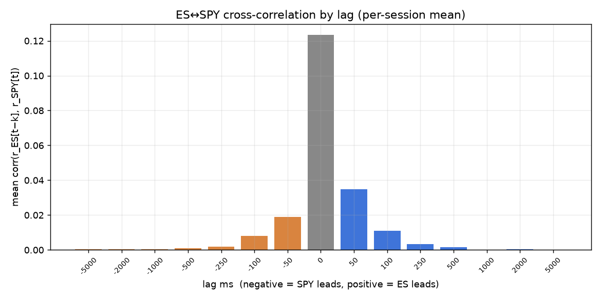
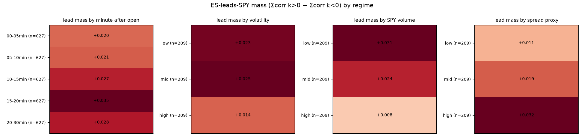
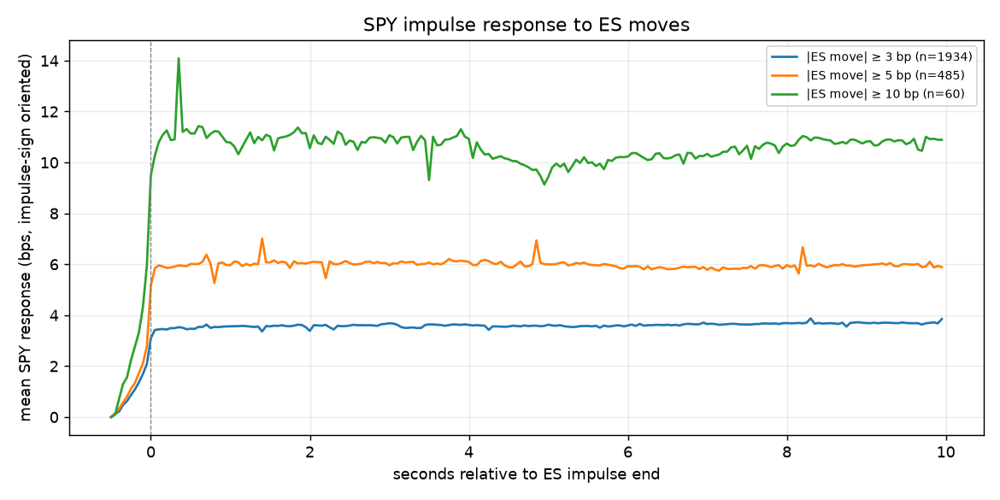
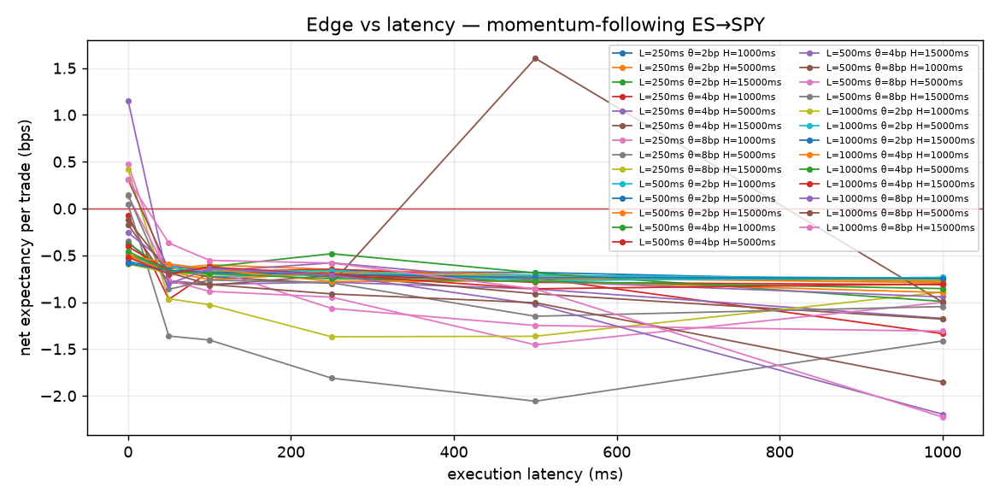

# ES/MES → SPY Lead-Lag Study

Sessions: 627 (2024-01-02 → 2026-07-02) · grid 50ms · window 09:30–10:00 ET · ES: Databento GLBX.MDP3 trades (continuous ES.v.0) · SPY: Alpaca SIP trades

## Verdict: **ES LEADS, NOT EXPLOITABLE**

- ✅ es_leads_statistically
- ✅ lead_visible_at_50ms_grid
- ❌ edge_exists_at_zero_latency
- ❌ edge_survives_100ms_latency
- ❌ walk_forward_pf_gate

## Phase 1 — Price discovery

- xcorr peak lag: **0 ms** (positive = ES leads); lead mass ES→SPY +0.052 vs SPY→ES +0.031
- Granger (627 sessions): ES→SPY significant in 99% of sessions, SPY→ES in 95%
- Info shares (627 sessions): Gonzalo-Granger CS(ES) = **0.75**; Hasbrouck IS(ES) ∈ [0.59, 0.84]; α_ES -0.0918 vs α_SPY +0.3632 (the instrument that error-corrects is the follower)
- Transfer entropy (627 sessions): net TE(ES→SPY) +0.00114 nats, significant in 100%

## Phase 2 — Opening-session conditioning

| slice | n | mean lead mass |
|---|---|---|
| minute:00-05min | 627 | +0.020 |
| minute:05-10min | 627 | +0.021 |
| minute:10-15min | 627 | +0.027 |
| minute:15-20min | 627 | +0.035 |
| minute:20-30min | 627 | +0.028 |
| volatility:low | 209 | +0.023 |
| volatility:mid | 209 | +0.025 |
| volatility:high | 209 | +0.014 |
| volume:low | 209 | +0.031 |
| volume:mid | 209 | +0.024 |
| volume:high | 209 | +0.008 |
| spread:low | 209 | +0.011 |
| spread:mid | 209 | +0.019 |
| spread:high | 209 | +0.032 |

## Phase 3 — Event study

| threshold | n | SPY resp @impulse end | final | ratio | half-resp delay | P(continue) |
|---|---|---|---|---|---|---|
| 3 bp | 1934 | +3.10 bp | +3.85 bp | 1.02 | 0 ms | 49% |
| 5 bp | 485 | +5.16 bp | +5.89 bp | 0.94 | 0 ms | 48% |
| 10 bp | 60 | +9.50 bp | +10.89 bp | 0.96 | 0 ms | 48% |

## Phase 4 — ES aggressor order flow → SPY

| window→horizon | sessions | mean rank IC | t | %>0 |
|---|---|---|---|---|
| imb1000ms_fwd500ms | 627 | +0.0343 | 38.2 | 94% |
| imb1000ms_fwd1000ms | 627 | +0.0286 | 28.1 | 87% |
| imb1000ms_fwd5000ms | 627 | +0.0097 | 9.1 | 64% |
| imb5000ms_fwd500ms | 627 | +0.0069 | 10.2 | 67% |
| imb5000ms_fwd1000ms | 627 | +0.0031 | 3.2 | 55% |
| imb5000ms_fwd5000ms | 627 | -0.0055 | -3.1 | 46% |

## Phase 5 — Strategy sweep (latency decay)

| L ms | θ bp | H ms | λ ms | trades | exp bps | win | PF | t |
|---|---|---|---|---|---|---|---|---|
| 500 | 8 | 1000 | 500 | 175 | +1.60 | 31% | 1.82 | 0.6 |
| 1000 | 8 | 1000 | 0 | 356 | +1.15 | 44% | 1.68 | 0.9 |
| 250 | 8 | 1000 | 0 | 125 | +0.47 | 55% | 1.30 | 0.9 |
| 250 | 8 | 15000 | 0 | 114 | +0.42 | 53% | 1.15 | 0.4 |
| 1000 | 8 | 15000 | 0 | 263 | +0.31 | 49% | 1.10 | 0.6 |
| 500 | 8 | 1000 | 0 | 181 | +0.31 | 50% | 1.20 | 0.8 |
| 500 | 8 | 15000 | 0 | 152 | +0.14 | 49% | 1.05 | 0.2 |
| 500 | 8 | 5000 | 0 | 162 | +0.14 | 49% | 1.06 | 0.2 |
| 250 | 8 | 5000 | 0 | 117 | +0.04 | 50% | 1.02 | 0.1 |
| 250 | 4 | 1000 | 0 | 1350 | -0.07 | 42% | 0.95 | -0.5 |
| 1000 | 8 | 5000 | 0 | 298 | -0.12 | 46% | 0.94 | -0.3 |
| 250 | 4 | 15000 | 0 | 803 | -0.17 | 48% | 0.94 | -0.6 |
| 500 | 4 | 15000 | 0 | 1301 | -0.26 | 48% | 0.91 | -1.2 |
| 250 | 4 | 5000 | 0 | 1058 | -0.35 | 47% | 0.84 | -1.9 |
| 1000 | 8 | 15000 | 50 | 263 | -0.37 | 44% | 0.89 | -0.7 |

## Phase 6 — Walk-forward + ML (at realistic latency)

- λ=100ms: OOS 529 trades, exp -1.04 bps, PF 0.58, PF≥1.2 gate: FAIL, params stable: False
- λ=250ms: OOS 816 trades, exp -0.87 bps, PF 0.58, PF≥1.2 gate: FAIL, params stable: True
- λ=500ms: OOS 1510 trades, exp -0.94 bps, PF 0.63, PF≥1.2 gate: FAIL, params stable: False
- ML (λ=100ms): GBM OOS IC +0.002, top/bottom-decile combined net -0.71 bps (24419 signals); linear IC +0.013
