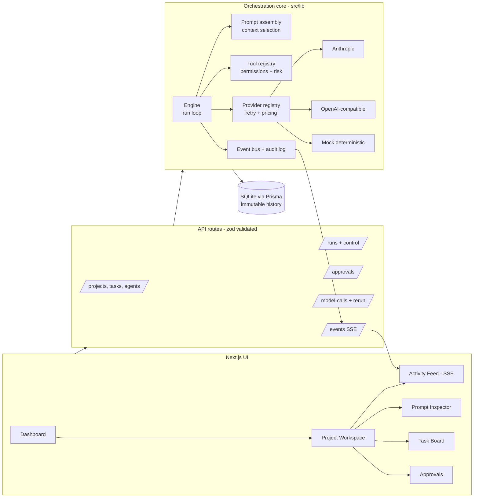
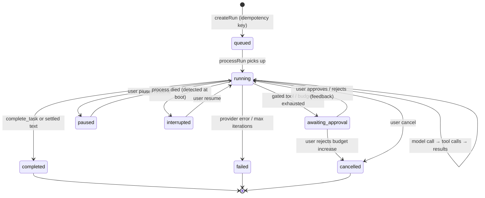

# Architecture

## Goals

1. **Model independence** — no provider is special-cased anywhere above the adapter layer.
2. **Full visibility** — every model interaction and side effect is an immutable database record and a live event.
3. **Human control** — pause/resume/cancel at run, project, or workspace granularity; approval gates for risky actions.
4. **Durability** — run state lives in the database, not in process memory; restarts are recoverable.
5. **Simplicity first** — the MVP favors boring, verifiable mechanisms (SQLite, in-process engine, SSE) with clean seams for the heavier production stack (Postgres, Redis/BullMQ, WebSockets).

## System overview

The orchestration core has **no dependency on the UI or HTTP layer** — API routes are thin, validated wrappers, and the engine can be driven from scripts and tests directly (`scripts/smoke.ts`, `tests/`).

## Run state machine

Key properties:

- The loop **re-reads run status from the DB every iteration and between tool calls**, so pause/cancel take effect at the next step boundary — even mid tool batch.
- The transcript (normalized message list) is persisted after every step; a resumed or restarted run continues exactly where it stopped.
- Only one in-process worker drives a given run (`activeRuns` registry); duplicate `processRun` calls are no-ops, and duplicate submissions are deduplicated by idempotency key.

## Module map

| Module | Responsibility |
|---|---|
| `src/lib/providers/types.ts` | Normalized messages, tools, usage, errors |
| `src/lib/providers/{anthropic,openaiCompat,mock}.ts` | Adapters |
| `src/lib/providers/registry.ts` | Adapter lookup, retry with exponential backoff, cost math |
| `src/lib/tools/defs.ts` | Tool specs: zod input schema, JSON Schema for models, risk level, approvability |
| `src/lib/tools/execute.ts` | The **only** execution path for tools: permission check → validation → effect → immutable ToolCall record + event |
| `src/lib/orchestrator/prompt.ts` | Layered context assembly with a recorded manifest |
| `src/lib/orchestrator/engine.ts` | Run lifecycle, approvals, budgets, recovery, user controls |
| `src/lib/orchestrator/demo.ts` | The seeded demonstration pipeline |
| `src/lib/orchestrator/rerun.ts` | Versioned prompt reruns (inspection-only) |
| `src/lib/events.ts` | Append-only audit log + in-process bus feeding SSE |

## Deliberate MVP deviations from the "recommended" stack

| Recommended | MVP choice | Why |
|---|---|---|
| PostgreSQL | SQLite (Prisma) | Zero-dependency local run; same Prisma data layer; Postgres migration is mechanical (see roadmap) |
| Redis + BullMQ | In-process engine with DB-durable state | One fewer moving part; the engine API (`createRun`/`processRun`) is the seam where a queue slots in |
| WebSockets | Server-Sent Events | One-directional stream is all the UI needs; SSE is trivial to operate |
| Component library | Hand-rolled Tailwind primitives | Avoids a large dependency for ~10 components |

These are documented trade-offs, not oversights — see `docs/limitations-roadmap.md`.
