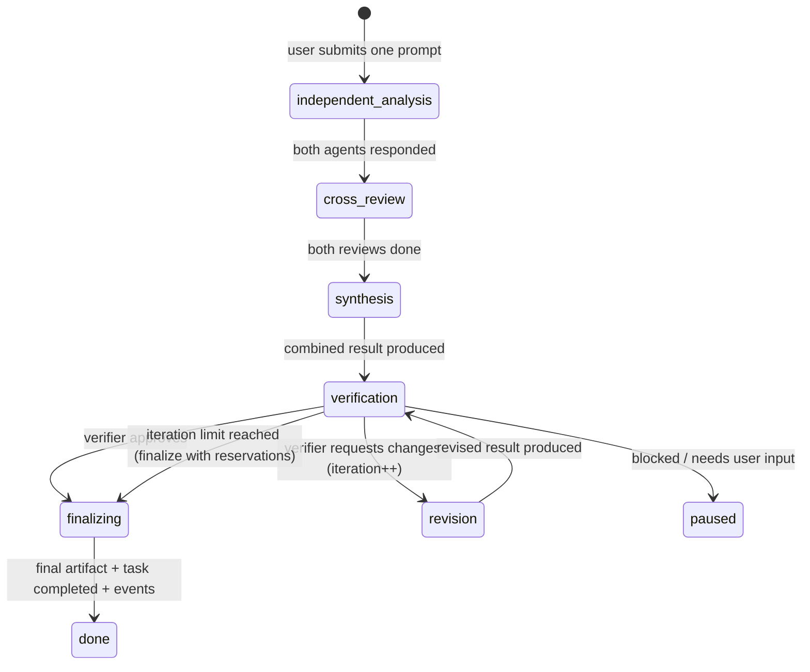

# Orchestration

There are two layers:

1. **The agent-run loop** (`engine.ts`) — executes ONE agent working autonomously with tools (below).
2. **The collaboration orchestrator** (`collaboration.ts`) — the reactive layer that chains agents together after every completion. This is what advances a project from a single user prompt to a reviewed, revised, finished result.

## Collaboration runs (`src/lib/orchestrator/collaboration.ts`)

A `ProjectRun` is a durable state machine driven by a single transition function, `advanceProjectRun(projectRunId)`:

Key mechanics:

- **`advanceProjectRun()` is called after every meaningful event** — start, step success, step failure, resume, retry, boot recovery — and performs exactly the work the persisted state says is missing.
- **Structured protocol**: every step must return JSON matching `AgentOutputSchema` (`prompts.ts`) — `status`/`nextAction` drive transitions, never free-form text. Malformed JSON gets one repair pass; if still invalid, the raw response is preserved on the run and the collaboration fails visibly (retryable).
- **Slot-based idempotency**: each step is recorded in the run's slot map (`initial:A`, `review:B`, `verification:2`, …) *before* the provider is called. Replayed or duplicate events find the slot occupied and never duplicate a model call; completed steps are always reused.
- **Atomic transitions**: guarded `updateMany({ where: { id, phase, status } })` — a concurrent worker that lost the race exits safely.
- **Budgets**: `maxIterations` revision cycles (default 3; on exhaustion the latest result is finalized with visible reviewer reservations) and `maxModelCalls` per collaboration (default 10; exceeding fails the run visibly).
- **Prompt builders** (`prompts.ts`) construct each phase's prompt with the relevant prior work embedded (peer output for reviews, both outputs + both reviews for synthesis, issues for revisions), and the context is recorded on every ModelCall.
- **Recovery**: at boot, in-flight collaborations resume from their last completed step; steps that were mid-provider-call are failed and re-run, completed steps are never repeated.
- **Controls**: `POST /api/project-runs/:id/control` — pause, resume, cancel, retry (retry clears only failed steps).
- **Roles**: agents A/B are the first two assigned to the project; the synthesizer is the designated manager/lead-role agent if present, else agent A; the other agent verifies.

Start one with `POST /api/projects/:id/collaborate { prompt }` or the Collaboration panel on the project Overview tab. The HTTP request only initiates; orchestration continues in the background and the UI follows persisted state + SSE.

## The agent-run loop (`src/lib/orchestrator/engine.ts`)

Each iteration:

1. **Reload the run from the DB.** If the user paused/cancelled it, stop here.
2. Enforce **iteration limit** (`maxIterations`, default 12) — prevents agent loops.
3. Enforce the **per-run budget** (`agent.maxCostPerRunUsd`). When exhausted, a `budget_increase` approval is created and the run parks in `awaiting_approval`. Each approval grants one more budget increment; rejecting cancels the run.
4. **Assemble context** (see below) and call the provider through `callWithRetry` (3 attempts, exponential backoff on retryable errors: rate limits, timeouts, overload). Every retry is a visible activity event.
5. Persist an immutable **ModelCall** (with the full prompt, tool definitions, settings, and context manifest) plus a **UsageRecord**; update run token/cost counters; append the assistant turn to the durable transcript.
6. **Execute tool calls in order** through the permissioned executor. Between each call the run status is re-checked, so cancellation is honored mid-batch.
   - A gated tool (per agent permissions / risk level) does not execute. The pending call is persisted, an **ApprovalRequest** is created, and the run parks. On approve → the tool executes and the run resumes; on reject → the agent receives the rejection (with your note) as the tool result and can adapt.
   - `complete_task` is terminal: it finalizes the run and updates the task.
7. If the model returned **no tool calls**, one continuation nudge is issued; a second consecutive text-only turn is treated as an implicit completion (with the text as the result summary).

## Context assembly (`prompt.ts`)

Layered and *selective* — the full project history is never dumped into a call:

- agent system prompt + `ROLE:` marker
- workspace instructions
- project name/objective/instructions/mode + team roster
- working rules (tool discipline, no fabrication, approval etiquette)
- task title/description/acceptance criteria + run objective
- pinned `ProjectMemory` entries
- project file listing (paths + versions, not contents — agents read files explicitly)
- the last 8 messages addressed to this agent or broadcast

The exact selection is recorded on the ModelCall as a machine-readable **context manifest**, so the Prompt Inspector always shows what the model saw and why.

## Review workflow

1. A task has an `ownerAgent` and optionally a `reviewerAgent`.
2. When the owner's run completes, the task moves to `awaiting_review` (reviewer set) or `completed`.
3. A reviewer run on the same task issues a `review_result` message; its completion summary decides: contains "changes requested" → task returns to `in_progress`; otherwise → `completed`.
4. Agents can also request reviews explicitly with the `request_review` tool.

## Failure handling

| Failure | Behavior |
|---|---|
| Provider timeout / rate limit / overload | Retried with backoff; each retry logged; final failure recorded on an error ModelCall and the run fails with the error preserved |
| Invalid tool input | zod validation error returned to the model as the tool result |
| Tool outside the agent's allowlist | `denied` ToolCall record; error fed back to the model |
| Conflicting file edits | `write_file` with a stale `baseVersion` fails with a conflict error + user notification |
| Agent loop | Iteration limit fails the run explicitly |
| Duplicate submission | `idempotencyKey` returns the existing run |
| Process restart | Boot hook (`src/instrumentation.ts`) marks orphaned `running` runs as `interrupted`; resuming continues from the persisted transcript |

## User controls

- Pause / resume / cancel a single run (`POST /api/runs/:id/control`)
- Pause every run in a project (`POST /api/projects/:id/pause`) — the "Pause all" header button
- Resolve approvals with a note (`POST /api/approvals/:id`)
- Edit & rerun any historical prompt (`POST /api/model-calls/:id/rerun`) — creates a new version; the original row is never modified; rerun responses are inspection-only (their tool calls are not executed)

## Orchestration modes

`manager | peer | review | debate | parallel | pipeline` is a per-project setting injected into every agent's context; the seeded demo uses `pipeline`. In the MVP the mode informs agent behavior (and the demo runner drives an explicit pipeline); mode-specific automatic schedulers are a roadmap item.
